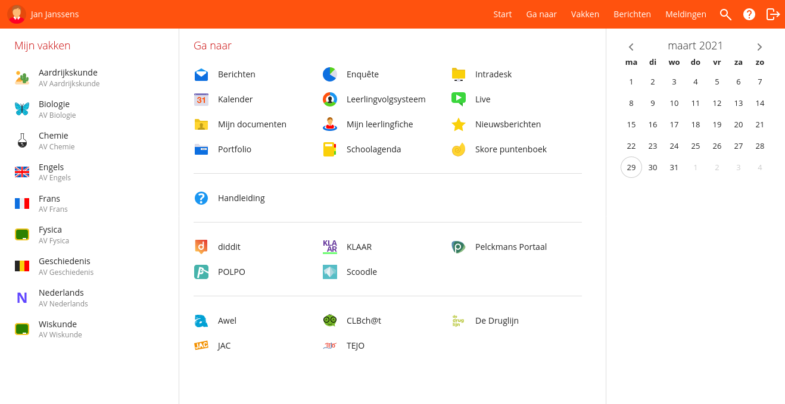

**:warning: The development of this add-on is discontinued. It is no longer available on the Mozilla add-on store. :warning:**

# Smartschool Plus

A browser extension that prettifies Smartschool and adds some additonal features.

## Features

### Nav bar

- The nav bar popup dialogs have a more appealing, modern look.

### Homepage

- The 'go to' menu has been added directly to the homepage.
- The small 'courses' menu (on the left) has been vertically expanded and it now has a *left* scrollbar.

### Grades

- Two total columns have been added to the grades table view.
- The default 'per course' view has been restyled to get a more modern appeal.

### Agenda

- The ugly old-fashioned borders around the agenda view and the left menu bar have been removed.
- The course 'boxes' got a more modern style.
- The default gray color has been lightened (more colors will be changed in the future).

## Screenshots

## Issues and feature requests

Found a bug or unexpected behaviour? Got a great idea or want to discuss something?

File an [issue] or start a new [discussion].

[issue]: https://github.com/JothCoder/smartschool-plus/issues
[discussion]: https://github.com/JothCoder/smartschool-plus/discussions

## Changelog

See [CHANGELOG.md](CHANGELOG.md).

## License

Licensed under the [MIT License](LICENSE).
